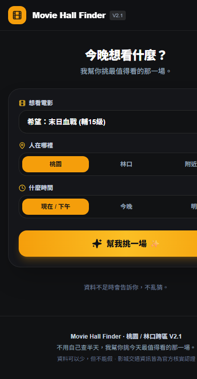
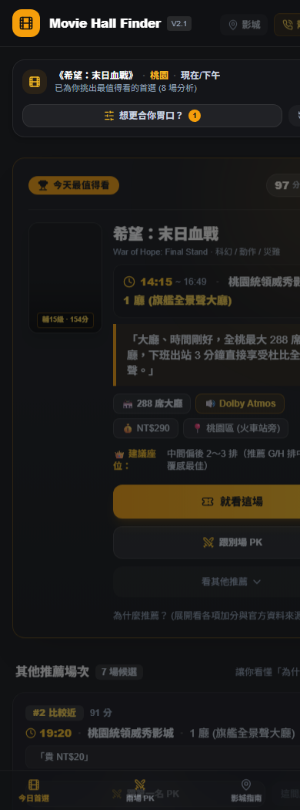
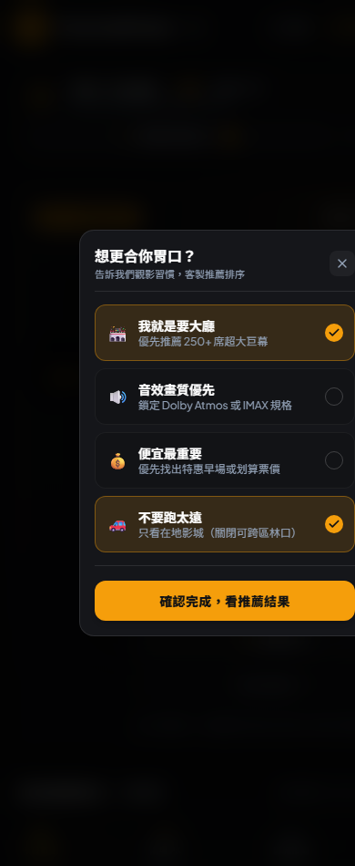
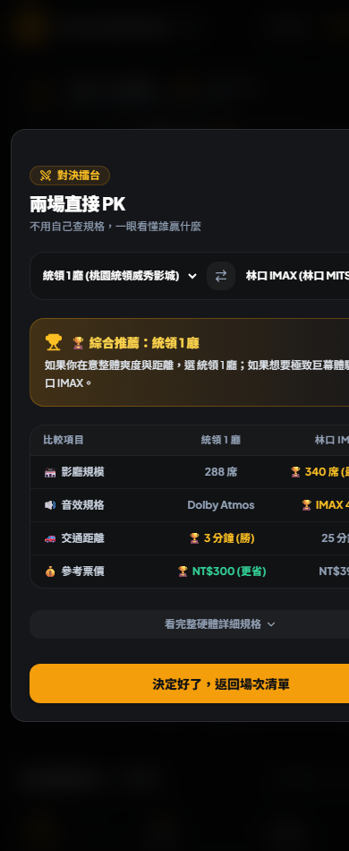
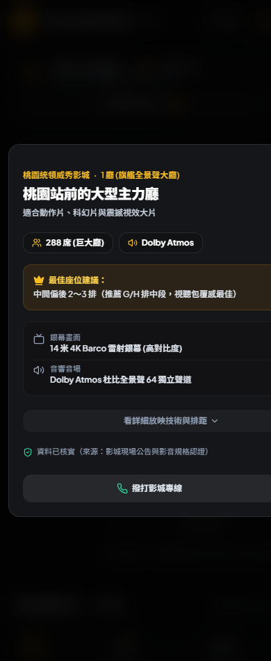
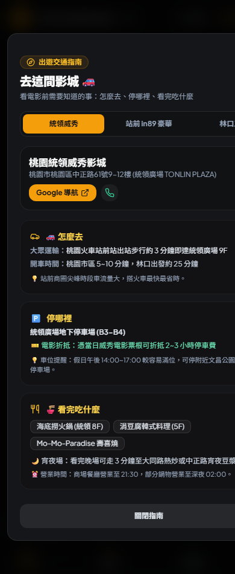
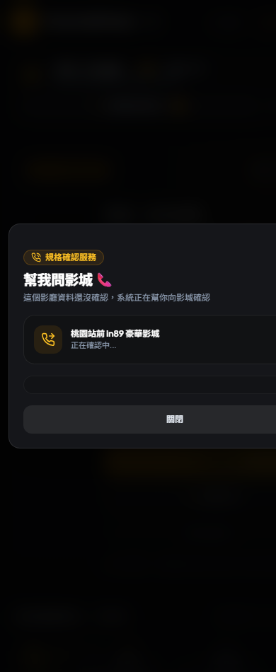
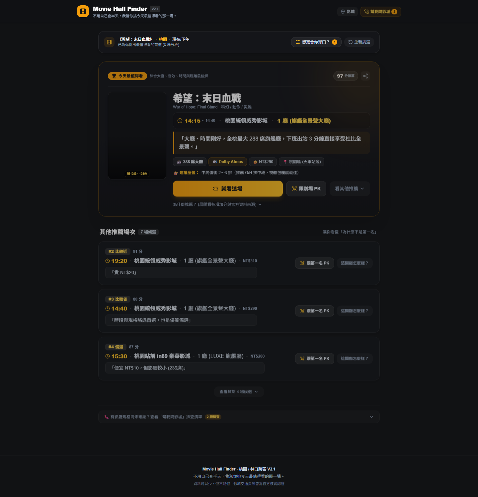

# 🎬 Movie Hall Finder (最佳影廳挑選器) — V2.1

> **「首頁只負責開始，搜尋結果才負責說服你。」**  
> 一個為 10 秒決策而生的現代電影院影廳推薦 Web App（支援桃園、林口跨區比對）。

---

## 🌐 線上體驗與測試 (Live Demo)

- **正式全球站 (GitHub Pages)**: [https://17app001.github.io/movie-hall-finder/](https://17app001.github.io/movie-hall-finder/)
- **手機極速備用通道 (Surge CDN)**: [https://movie-hall-finder-taoyuan.surge.sh](https://movie-hall-finder-taoyuan.surge.sh)

---

## 📱 Niko Review Gate V2.1 截圖展示

### 1. 首頁純搜尋入口 (`mobile_01_homepage.png`)
首頁僅保留 3 步極簡選擇（電影、地點、時間）與主要 CTA「幫我挑一場 ✨」，徹底告別後台資訊儀表板感。


### 2. 搜尋結果 Top Pick 英雄卡 (`mobile_02_search_result_top_pick.png`)
點擊「幫我挑一場」後進入決策模式，首屏即呈現今日最值得看首選、海報、時間、影城、影廳、人話推薦短評與直覺操作。


### 3. 想更合你胃口？生活化偏好設定 (`mobile_03_preference_drawer.png`)
5 項人話生活化偏好（我就是要大廳、音效畫質優先、便宜最重要、不要跑太遠），隨選隨排。


### 4. 兩場直接 PK 勝負對決 (`mobile_04_hall_pk.png`)
不用查複雜數據，先給結論與勝負對決表（想看得爽選 A，想省錢選 B）。


### 5. 影廳詳情與帝王位 (`mobile_05_hall_detail.png`)
人話標題「桃園站前的大型主力廳」，提供最佳座位觀影角度與官方認證硬體規格。


### 6. 去這間影城出遊指南 (`mobile_06_theater_guide.png`)
看電影必備三大情報：🚗 怎麼去 / 🅿️ 停哪裡（折抵規則）/ 🍜 看完吃什麼。


### 7. 幫我問影城 (`mobile_07_ask_theater.png`)
規格有缺漏時，提供安心的官方確認機制，不盲猜不造假。


### 8. 電腦版全景 (`desktop_01_main.png`)
支援桌面大螢幕高解析度自適應佈局。


> 💡 **截圖目錄規範**：
> - 手機版最新截圖：[`docs/screenshots/mobile/`](./docs/screenshots/mobile/)
> - 電腦版最新截圖：[`docs/screenshots/desktop/`](./docs/screenshots/desktop/)
> - V1 歷史截圖存檔：[`docs/archive/screenshots-v1/`](./docs/archive/screenshots-v1/)

---

## 🎨 設計規範與氣質 (Midnight Cinema)

- **背景色**: `#111214` (Midnight Dark)
- **卡片底色**: `#15161A` (Cinema Surface)
- **文字**: `#F5F5F7` (主文字) / `#9A9CA2` (次要輔助)
- **琥珀橘點綴**: `#FF9F1C` (約 5% 點睛，僅用於首選標章與主行動)
- **原則**: **資料可以少，但不能假** (Real Data Only)

---

## 🛠️ 本地開發與測試

```bash
# 安裝依賴
npm install

# 啟動本機開發
npm run dev

# 執行單元與整合測試
npm test

# 生產建置
npm run build
```
